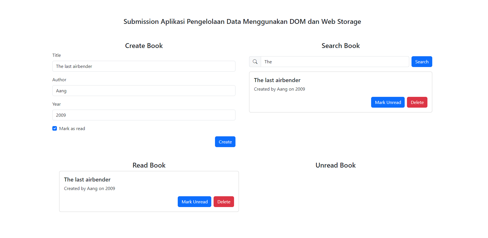

# Submission Aplikasi Pengelolaan Data Menggunakan DOM dan Web Storage

| Field | Information |
|---|---|
| Student Name | I KOMANG GEDE APRIANA (gedeapriana) |
| Submission ID | 2866258 |
| Course | [Belajar Membuat Front-End Web untuk Pemula](https://www.dicoding.com/academies/315) |
| Dikirim pada | 24-Feb-2024 20:59:39 |
| Submission | [Submission Aplikasi Pengelolaan Data Menggunakan DOM dan Web Storage](https://www.dicoding.com/academies/315/tutorials/16849) |
| Tipe | Token: DBS Foundation Coding Camp 2024: Front-End Web Developer Enrollment |
| Stars |  |

You have learned:
- JavaScript basics from statements, expressions, variable creation, data types, operators, if and switch branching, data structure with arrays and objects, to function creation.
- Knowing the Browser Object Model (BOM), Document Object Model (DOM), and Events in the website. And you are able to change website content through DOM manipulation techniques and provide Events.
- Get to know localStorage and sessionStorage as Web Storage. And use both of them.
- Finally, you have been able to create a website that has the functionality of managing To-Do using JavaScript by utilizing DOM manipulation techniques, Events, and Web Storage through the exercises given in this class.

## Criteria
- [x] Able to Add Book Data
- [x] Has Two Bookshelves
- [x] Can Move Books between Shelves
- [x] Can Delete Book Data
- [x] [Utilize localStorage to Store Book Data
